# Class Inheritance 

## Inheritance

- Inheritance ทำให้เราสามารถสร้าง class ใหม่ เพื่อขยายความสามารถของคลาสที่มีอยู่ โดยใช้คลาสที่มีอยู่เป็น Base class
- เมื่อทำการ inheritance มาแล้ว จะได้คลาสที่เรียกว่า Derived class
- ใน Derived class สามารถเข้าถึงสมาชิกได้ทั้งของ Base class และของตัวมันเอง  
  - อย่างไรก็ตาม จะขึ้นอยู่กับการกำหนดระดับการเข้าถึง (access level) ใน base class ด้วย

- อาจพูดได้ว่า derived class คือส่วนขยายของ base class
- อย่างไรก็ตาม derived class ไม่สามารถขจัดสิ่งที่ base class นิยามไว้ออกไปได้

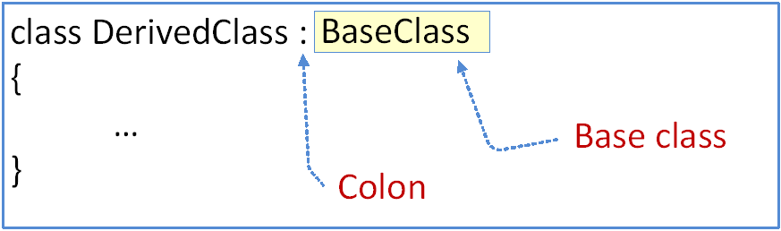

__รูปที่ 1__ ตัวอย่างการเขียน base class ในภาษา C# 

## UML class diagram
เพื่อให้อธิบายคลาสได้เข้าใจตรงกัน นักออกแบบโปรแกรมจึงคิดต้นรูปแบบในการนำเสนอคลาสให้เป็นไดอะแกรมมาตรฐาน เป็นส่วนหนึ่งของ UML

ในการเขียนแผนผังการสืบทอดคลาส จะเขียนเส้นทึบที่มีหัวลูกศร ชี้จาก Derived class ไปยัง base class (ดังภาพด้านซ้าย) และเมื่อสืบทอดคลาสแล้วจะได้รายละเอียดของคลาสใหม่ดังรูปคลาสด้านขวา

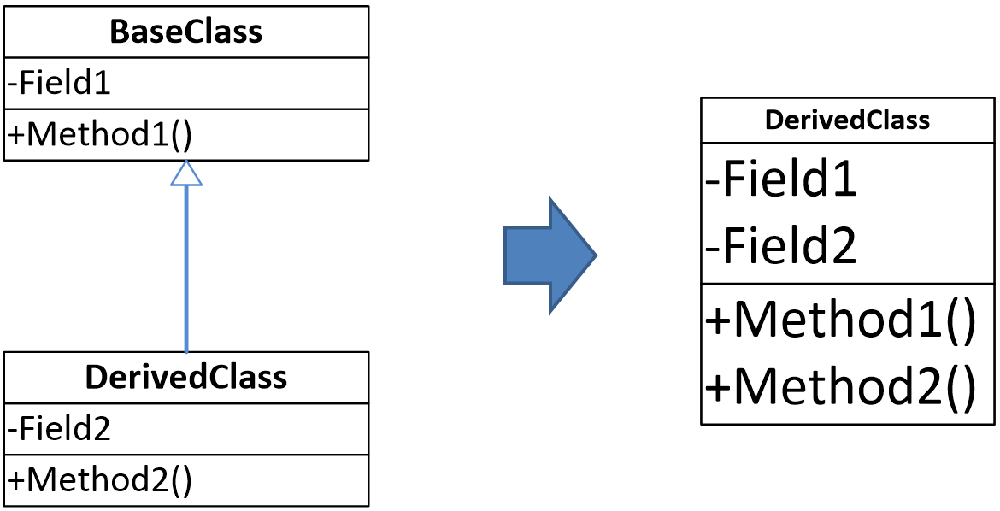

__รูปที่ 2__ ตัวอย่างการเขียนไดอะแกรมของการสืบทอดคลาส 

## Conceptual Diagram
เพื่อให้เข้าใจการสิบทอดคลาสมากขึ้น ให้พิจารณารูปที่ 3 โดยให้คลาสที่มีพื้นหลังสีฟ้าคือ base class และคลาสที่มีพื้นหลังสึชมพูคือ derived class

 

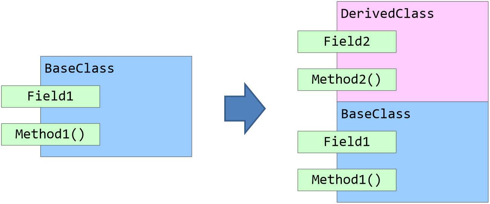

__รูปที่ 3__ แนวคิดเบื้องต้นของการสืบทอดคลาส 

จากภาพด้านขวาคลาสใหม่ที่ได้จากการสืบทอดจะประกอบด้วยส่วนของ base class และ derived class รวมอยู่ด้วยกัน ดังนั้นการสร้างวัตถุจากคลาสที่สืบทอดจึงมีส่วนของคลาสหลักอยู่ด้วยเสมอ

## Accessing the Inherited Members 
ในกระบวนการสสืบทอดคลาสนั้น เมื่อสร้างวัตถุจากคลาสที่สสืบทอด จึงมองเสมือนว่าวัตถุนั้นประกอบด้วยทั้งส่วนทีฟ้าและสีชมพูเสมอ แต่ในบางครั้งเราอาจจะต้องการเจาะจงที่จะทำงานกับส่วนที่อยู่ใน base class โดยตรง ก็มีวิธีการที่จะเข้าถึงได้โดยตรงดังรูปที่ 4

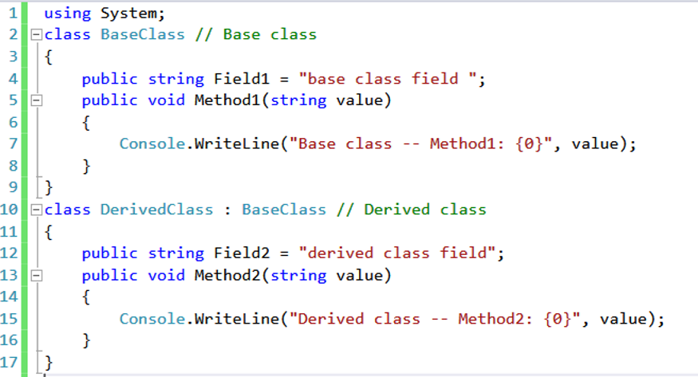

__รูปที่ 4__ ตัวอย่างในการสืบทอดคลาส 

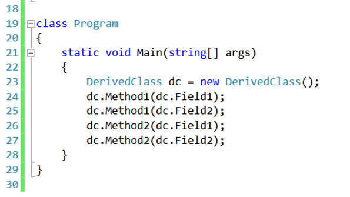

__รูปที่ 5__  ตัวอย่างในการเข้าถึงสมาชิกใน base class

## ทุกๆ คลาส Derived จากคลาส object 
ใน .NET Framework นั้น โค้ดที่เขียนขึ้นในภาษาต่างๆ จะสามารถใช้งานวัตถุร่วมกันได้ เสมือนเขียนด้วยภาษาเดียวกัน ที่เป็นดังนั้นเพราะวัตถุทั้งหมดมีการสืบทอดมาจากคลาสหลักเดียวกัน ในภาษา C#  จะมีคลาสที่ชื่อว่า Object ที่ทำหน้าที่ base class  ให้กับทุกคลาส

ถึงแม้ว่าจะเป็นคลาสที่เราเขียนขึ้นเองและไม่ได้ระบุ base class ก็ตาม แต่ภาษา C# จะกำหนดให้คลาสของเราสืบทอดมาจากคลาสที่ชื่อว่า System.Object โดยอัตโนมัติ

__รูปที่ 6__ ทุกๆ คลาส Derived จากคลาส object

## การทำ Multiple Inheritance

วัตถุในโลกแห่งความเป็นจริงนั้น วัตถุสามารถสืบทอดคุณสมบัติจาก base class หลายๆ ตัว แต่ในภาษา C# นั้น เราสามารถทำ inheritance ได้จาก base class เพียงตัวเดียวเท่านั้น (เรียกว่า single inheritance) เพื่อไม่ให้เกิดความกำกวม
แต่การทำ inheritence ในภาษา C# นั้น ทำได้ไม่จำกัดจำนวนชั้น

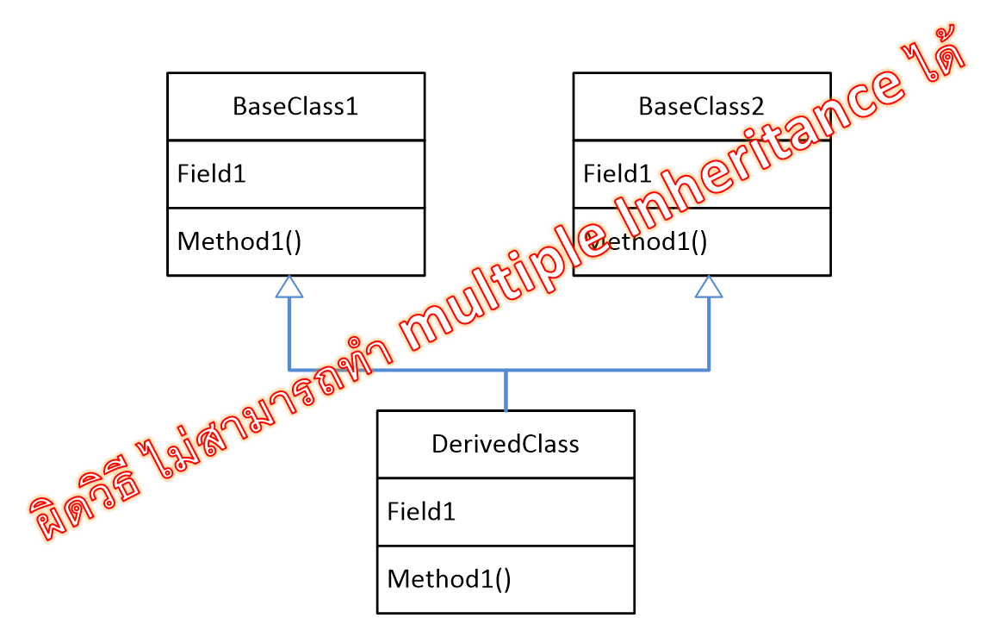

__รูปที่ 7__ การทำ Inheritance ในภาษา C#

## Inheritance Hierachy

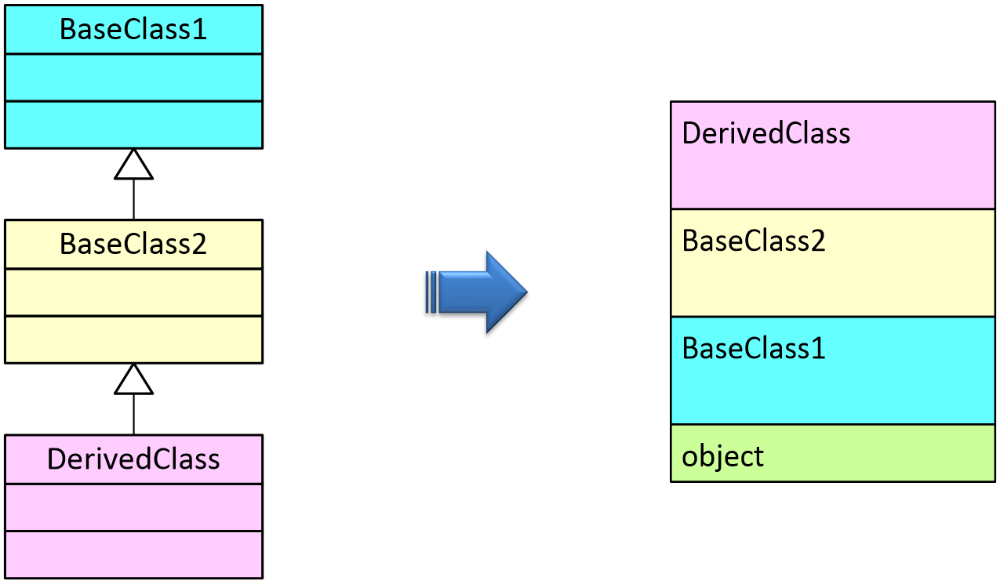

__รูปที่ 8__ การทำ Inheritance ในภาษา C#

## Masking Members of a Base Class 

- derived class ไม่สามารถลบความสามารถของ base class
แต่สามารถปิดบัง (mask) ความสามารถนั้นได้ 
   - โดยการสร้าง field ที่มีชื่อเดียวกันกับ field ของ base class
   - โดยการสร้าง method ที่มี signature เดียวกันกับ method ของ base class
   - โดยการใช้ modifier “new”
- เราสามารถปิดบังสมาชิกที่เป็น static ได้ด้วย

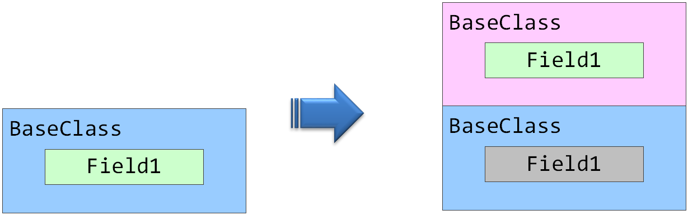

__รูปที่ 9__ การสืบทอดที่ derived class มีการปิดบังความสามารถของ base class

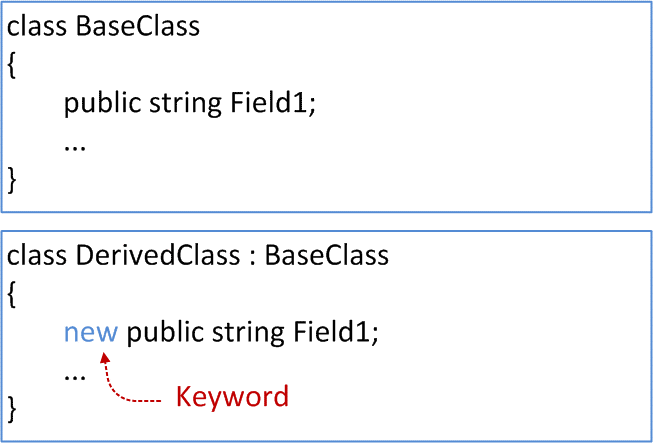

__รูปที่ 10__ การปิดบังความสามารถของ base class โดยใช้คีย์เวิร์ด new

## Hiding a field and a method of the base class
การซ่อนสมาชิดของ base class
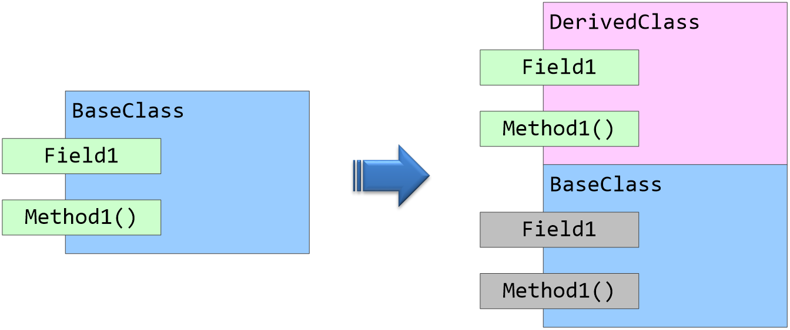
__รูปที่ 11__ แนวคิดในการซ่อนความสามารถของ base class 

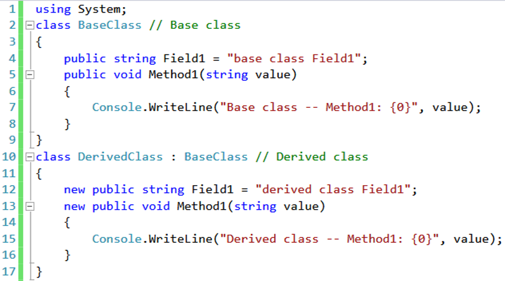

__รูปที่ 12__ การเขียนโปรแกรมเพื่อซ่อนความสามารถของ base class 

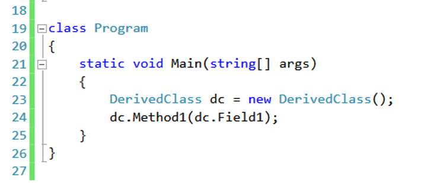

__รูปที่ 13__ การเขียนโปรแกรมเพื่อซ่อนความสามารถของ base class 

## Base Access 

- ในบางกรณี เราซ่อน Field หรือ Method ของ base class ไว้แล้ว แต่ด้วยวัตถุประสงค์บางประการ เราต้องการเข้าถึงมัน จะทำได้อย่างไร
- เราสามารถทำได้ด้วยการใส่ keyword “base” หน้าชื่อ Field ของ base class ที่ต้องการ

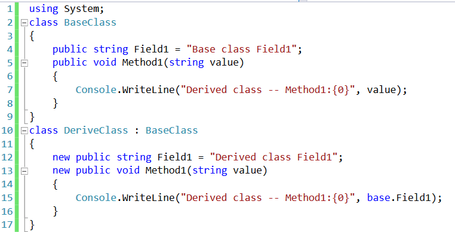
 
__รูปที่ 14__ การเข้าถึงสมาชิกใน base class 

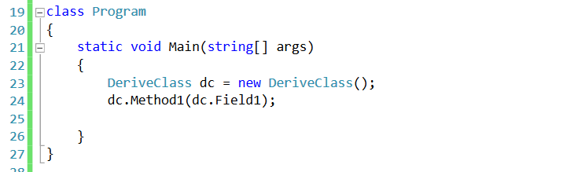

__รูปที่ 15__ การเข้าถึงสมาชิกใน base class 

- ในการพัฒนาโปรแกรมจริง ถ้าพบว่าต้องใช้กรณีนี้บ่อยๆ ก็ต้องพิจารณาเรื่องการออกแบบแผนผังคลาสใน UML ว่าเหมาะสมหรือไม่ เพราะการออกแบบที่ดี ไม่ควรใช้งานในรูปแบบนี้บ่อยๆ

## Using References to a Base Class 

- วัตถุที่เราใช้งาน มักจะประกอบด้วยวัตถุที่สร้างจาก base class และ derived class ผสมปนเปกันอยู่
- การอ้างถึง derived class คือการอ้างถึงวัตถุก้อนใหญ่ ที่รวมเอาการอ้างถึงวัตถุของ base class ด้วย
- การที่จะอ้างถึงวัตถุของ base class เพียงอย่างเดียว ทำได้โดยการใช้ cast operator
- cast operator คือ การเขียน (class or type ) ไว้หน้า reference to object 

### ลำดับขั้นการใช้งาน

1. สร้าง reference และ object ของ derived class 
2. ประกาศ reference ของ base class
3. นำ reference ของ derived class มากำหนดให้ reference ของ base class ในข้อ 2 โดย casting ด้วยชื่อของ base class 

## Using References to a Base Class 

## Virtual and Override Methods 
- การใช้ reference ไปยัง base class มีข้อจำกัดตรงที่สามารถใช้งานได้เฉพาะ member ใน base class เท่านั้น
- เราสามารถใช้ virtual เพื่อเข้าถึงสมาชิกใน base class โดยใช้ reference ของ derived class ได้โดยตรง

### การใช้งาน Virtual and Override Methods
- method ของ base class และ derived class ต้องมี signature เหมือนกันทุกประการ ทั้งชนิดและจำนวนของพารามิเตอร์ รวมถึง return type
- method ใน base class ต้อง modify เป็น virtual
- method ใน derived class ต้อง modify เป็น override

### ข้อควรจำในการใช้ override modifier
- method ที่ override (อยู่ใน derived class) และ overridden (อยู่ใน base class) ต้องมี accessibility เดียวกัน เช่น ต้องเป็น public หรือ private เหมือนๆ กัน
- ไม่สามารถ override method ที่เป็น static
- ไม่สามารถ override method ที่ไม่ประกาศเป็น virtual
- สมาชิกของคลาสที่สามารถทำ override ได้  ได้แก่ Methods, properties,  indexers และ events

## Overriding a Method Marked override

- ในการ override สามารถทำข้ามชั้นของการ inheritance ได้
- เมื่อใช้ reference to base class การเรียกใช้งาน method จะส่งต่อการเรียกขึ้นไปจนถึง class สุดท้ายของการ override
- method ใดในลำดับขั้นการสืบทอด ที่ไม่ได้ทำเครื่องหมาย override มันจะไม่ถูกเรียกใช้งาน

### Case 1: Declaring with override keyword 

### Case 2: Declaring with new keyword

## Overriding Other Member Types 

## Inherited Protected Members

- เมื่อ  derived class ทำการ inherit สมาชิกที่เป็น protected มาแล้ว สมาชิกนั้นก็จะเป็น protected member  ของ derived class ไปโดยปริยาย 
- นั่นหมายความว่า protected members ของ derived classes จะเข้าสามารถถึงได้ตามกฏการเข้าถึงของภาษา   

