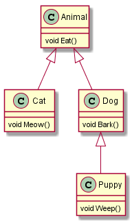
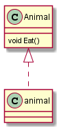
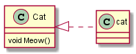
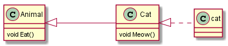
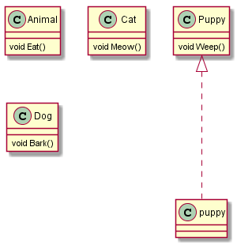
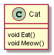

# Activity 1 Inheritance

## แนะนำ 
 ในการเขียนโปรแกรมจากคลาสไดอะแกรมนั้น เราต้องอ่านไดอะแกรมให้รู้และเข้าใจว่าไดอะแกรมบอกอะไรแก่เราบ้าง (รายละเอียดเหล่านี้จะเรียนในเรื่อง UML diagram แต่ในการทดลองจะแสดงไดอะแกรมอย่างง่าย ไม่ซับซ้อนมาก เพื่อให้เข้าใจตรงกันและให้เห็นวิธีการนำไดอะแกรมมาเขียนเป็นโปรแกรม)  

ให้พิจารณาไดอะแกรมในรูปที่ 1

 

__รูปที่ 1__ ไดอะแกรมของตัวอย่างสัตว์เลี้ยงในบ้าน

จากไดอะแกรมพบว่ามีคลาสจำนวน 4 คลาส และมีการสืบทอด โดนอธิบายได้ดังนี้
1. สัตว์ มีความสามารถ Eat()
2. แมว กิน Eat() และ ร้อง Meow()
3. สุนัข กิน Eat() และ เห่า Bark()
4. ลูกสุนัข กิน Eat() เห่า Bark() และ ร้อง Weep()

การเขียน class ให้เริ่มเขียนจาก base class ตามด้วย derived class ตามลำดับการสืบทอดจนครบ

## การทดลอง
1. สร้าง Project เป็น Console project  ชื่อ Animal
2. เขียนคลาส Animal ไว้นอกคลาส Program ดังต่อไปนี้ 
``` C#
using System;
using System.Collections.Generic;
using System.Linq;
using System.Text;
using System.Threading.Tasks;

namespace Animal
{
    class Animal            // เพิ่ม class ชื่อ  Animal
    {
        public void Eat()   // เมธอด Eat()
        { 
           // ยังไม่ต้องเขียน Code         
        }
    }
    class Program
    {
        static void Main(string[] args)
        {
        }
    }
}
```
3. เพิ่ม derived class ที่ชื่อ `Cat` ไว้ด้านล่างคลาส animal โดยมีการสืบทอดมาจากคลาส Animal  (ดู Code ที่เสร็จแล้วได้จาก [คลิก ตัวอย่าง](Example/Animal/Animal/Program.cs))

```C#
    class Cat : Animal  
    {
        public void Meow() 
        {

        }
    }
```

4. เพิ่มคลาส Dog ที่สืบทอดจาก Animal และมีความสามารถ Bark

```C#
    class Puppy : Dog
    {
        public void Weep()
        {
            Console.WriteLine("weeping...");
        }
    }
```

5. เพิ่มคลาส Puppy ที่สืบทอดจาก Dog และมีความสามารถ Weep

```C#
    class Puppy : Dog
    {
        public void Weep()
        {
            Console.WriteLine("weeping...");
        }
    }

```

## การใช้งานคลาสที่สร้างขึ้น

6. แก้ไขเมธอด Main เพื่อสร้าง Object ตามไดอะแกรมในรูปที่ 2

 

__รูปที่ 2__ การสร้างวัตถุ Animal

7. เรียกเมธอด Eat()  ของ animal
***
####  __ข้อควรระวัง!!!__ 
ภาษา C# เป็นภาษาแบบ case-sensitive  เราใช้ชื่อ Animal เป็นชื่อคลาสและ animal เป็นชื่อ object
***

```C#
    ....
    class Program
    {
        static void Main(string[] args)
        {
            Animal animal = new Animal();   // สร้างออปเจ็กต์ animal
            animal.Eat();                   // เรียกเมธอด Eat()
        }
    }
    ....

```
***
### รัน บันทึก และอธิบายผลการทำงานของโปรแกรม

 
***

8 สร้างออปเจ็กต์ ตามไดอะแกรมในรูปที่ 3


 

__รูปที่ 3__ การสร้างวัตถุ cat

จากรูปที่ 3 เมื่อเราสร้าง cat ก็จะพบว่ามีคลาส Animal ซึ่งเป็น base class ของ Cat รวมอยู่ในลำดับการสืบทอดด้วย ดังรูปที่ 4

 

__รูปที่ 4__ ลำดับการสืยทอดเมื่อสร้างวัตถุ cat

8.1 แก้ไข Main(...)  ให้เป็นดังต่อไปนี้

```C#
    ...
    class Program
    {
        static void Main(string[] args)
        {
            Cat cat = new Cat();
            cat.Eat();
            cat.Meow();
        }
    }
    ...
```
***
### รัน บันทึก และอธิบายผลการทำงานของโปรแกรม

 
***

9. สร้างออปเจ็กต์ puppy จากคลาส Puppy ตามไดอะแกรมในรูปที่ 5

 

__รูปที่ 5__ สร้างวัตถุ puppy

9.1 แก้ไข Main(...)  ให้เป็นดังต่อไปนี้

```C#
    ...
    class Program
    {
        static void Main(string[] args)
        {
            Puppy puppy = new Puppy();
            puppy.Eat();
            puppy.Bark();
            puppy.Weep();
        }
    }
    ...
```

***
### รัน บันทึก และอธิบายผลการทำงานของโปรแกรม

 
***


## แบบฝึกหัด
ให้เขียนคลาสไดอะแกรม ที่เปิดเผยให้เห็นถึงเมธอดที่สามารถเรียกใช้งานได้ของแต่ละคลาส 

__ตัวอย่าง__

 


หมายเหตุ source code  ของ diagram ดูได้จากโฟลเดอร์ [puml-diagram](./puml-diagram/) แต่ละไฟล์จะมีภาพ .png แนบมาให้แล้ว วิธีการสร้างจะอธิบายในชั้นเรียน