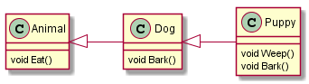

# Activity 2 Masking Members of a Base Class

## แนะนำ
derived class ไม่สามารถลบความสามารถของ base class แต่สามารถปิดบัง (mask) ความสามารถนั้นได้ 
- โดยการสร้าง field ที่มีชื่อเดียวกันกับ field ของ base class
- โดยการสร้าง method ที่มี signature เดียวกันกับ method ของ base class
- โดยการใช้ modifier “new”

พิจารณาไดอะแกรมในรูปที่ 1


__รูปที่ 1__ ไดอะแกรมของสัตว์ สุนัข และลูกสุนัข

จากไดอะแกรม จะเห็นว่าบ่อยครั้งที่ลูกสุนัขก็เห่า แต่เป็นเสียงคนละอย่างกับสุนัขโต ดังนั้นเราควรมีวิธีที่จะทำให้ลูกสุนัขมีเสียงเห่าเป็นของตัวเองได้ด้วย เราสามารถปิดบังความสามารถของ base class ได้ด้วยการใช้คำสั่ง new

## การทดลอง
1. สร้างโปรเจคต์ใหม่ ชื่อ AnimalMasking
2. เพิ่ม code ดังต่อไปนี้
2.1 คลาส Animal

``` C#
   class Animal            // 1.1 เพิ่ม class ชื่อ  Animal
    {
        public void Eat()   // 1.2 เพิ่มเมธอด Eat()
        {
            Console.WriteLine("eating...");
        }
    }
    
```
2.2 คลาส Dog
``` C#
    class Dog : Animal
    {
        public void Bark()
        {
            Console.WriteLine("dog big barking...");    
        }
    }
```

2.3 คลาส Puppy

``` C#
 class Puppy : Dog
    {
        public void Weep()
        {
            Console.WriteLine("weeping...");
        }
        new public void Bark()
        {
            Console.WriteLine("puppy small bark...");
        }
    }
``` 

2.4 เมธอด Main

``` C#
        static void Main(string[] args)
        {
            Dog dog = new Dog();
            Puppy puppy = new Puppy();
            dog.Bark();
            puppy.Bark();
        }
``` 

***
### รัน บันทึก และอธิบายผลการทำงานของโปรแกรม

 
***